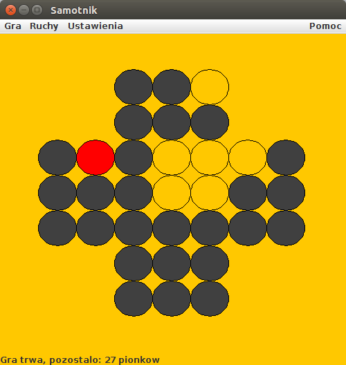

# Samotnik
<i>Samotnik (gra logiczna)</i>
 
Celem gry jest zostawienie na planszy jak najmniejszej liczby pionków. Idealnym rozwiązaniem jest pozostawienie 
jednego pionka, najlepiej w centrum. Pionka można zbić przeskakując go w pionie lub w poziomie. Nie można wykonywać ruchów na ukos 
oraz nie można bić kilka pionków za jednym ruchem.
 
<b>Treść zadania:</b> [zad6.pdf](./zad6.pdf) 
<b>Widok z gry:</b> 

